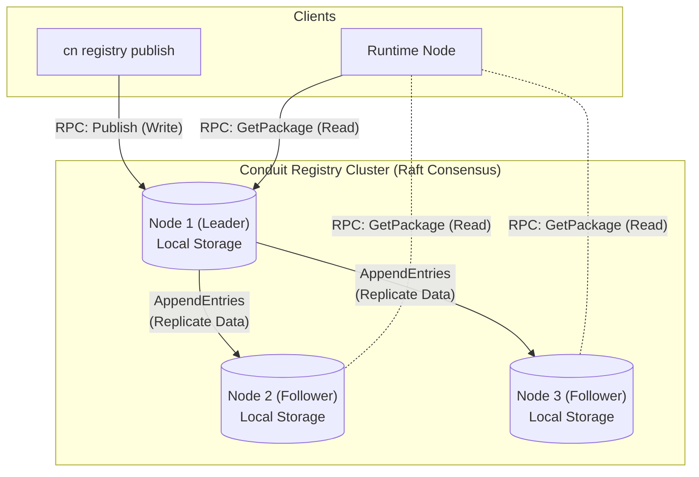

# Conduit Service Registry (CSR) Design

The Conduit Service Registry (CSR) is the mechanism for distributing Conduit services and applications. 

## 1. Philosophy: "The Registry is a Node"

In the Conduit ecosystem, the Registry is not a passive file server; it is an active **Conduit Node**. This means it participates in the network, uses the standard WebSocket RPC transport, and can be clustered for High Availability (HA) using the same consensus mechanisms as other services.

By treating the Registry as a Node:
1.  **Unified Transport**: No separate HTTP/FTP stack needed; it uses the existing Conduit RPC.
2.  **High Availability**: Multiple Registry Nodes can form a cluster to ensure uptime.
3.  **P2P Distribution**: Registry nodes can replicate packages between themselves, or even offload distribution to standard nodes (BitTorrent-style) in the future.

## 2. Architecture



## 3. The Registry Service Contract

Interaction with the Registry is defined by a standard Conduit Interface. This allows any node to potentially act as a registry or cache.

```csharp
[ConduitService("Conduit.Registry")]
public interface IRegistryService
{
    /// <summary>
    /// Publishes a new package version to the registry.
    /// </summary>
    Task<RegistryResult> PublishPackageAsync(PackageMetadata metadata, byte[] packageData);

    /// <summary>
    /// Retrieves the binary content of a package.
    /// </summary>
    Task<byte[]> GetPackageAsync(string packageName, string version);

    /// <summary>
    /// Lists available versions for a specific package.
    /// </summary>
    Task<List<PackageVersion>> ListVersionsAsync(string packageName);

    /// <summary>
    /// Gets the latest version metadata for a package.
    /// </summary>
    Task<PackageMetadata> GetLatestVersionAsync(string packageName);
}
```

## 4. High Availability & Consistency (Raft)

The Registry uses the **Raft Consensus Algorithm** to ensure strong consistency and high availability.

*   **Shared Nothing Architecture**: Each Registry Node has its own independent local storage (disk). There is no shared SAN or NAS.
*   **Log Replication**:
    1.  A `PublishPackage` request is sent to the **Leader**.
    2.  The Leader appends the operation (add package) to its **Raft Log**.
    3.  The Leader replicates the log entry (including the `.cnp` binary data) to the **Followers**.
    4.  Once a quorum (majority) acknowledges the entry, the Leader commits it and applies it to its State Machine (making it visible).
    5.  Followers commit and apply to their local state.
*   **Fault Tolerance**: The cluster can survive the failure of `(N-1)/2` nodes. A 3-node cluster can survive 1 failure.

### Storage Strategies
1.  **Raft Log**: Stores the sequence of operations (Publish, Deprecate).
2.  **State Machine**: The current index of available packages.
3.  **Blob Storage**: The actual `.cnp` files are stored on the node's local filesystem, referenced by the State Machine.

## 5. The Conduit Package (`.cnp`)

A `.cnp` file is the fundamental unit of deployment. It is a standard ZIP archive.

### Structure
```
my-service.cnp (zip)
├── conduit.json       # Manifest
├── bin/               # Compiled binaries (DLLs, executables)
├── assets/            # Static files
└── signature.sig      # Cryptographic signature
```

### Manifest (`conduit.json`)
```json
{
  "id": "com.mycompany.userservice",
  "version": "1.0.4",
  "type": "service", 
  "entryPoint": "bin/UserService.dll",
  "runtime": "dotnet-8.0",
  "dependencies": {
    "com.conduit.core": "^2.0.0"
  }
}
```

## 6. The Registry CLI (`cn registry`)

The Registry is managed via the unified `cn` CLI tool.

### Commands

*   **`cn registry pack`**
    *   Zips the build output into a `.cnp`.
*   **`cn registry publish`**
    *   Connects to the configured registry (default: `wss://registry.conduit.net`).
    *   Calls `IRegistryService.PublishPackageAsync`.
*   **`cn registry install <package>`**
    *   Calls `IRegistryService.GetPackageAsync`.
    *   Unzips to local cache.

## 7. Security

Since the Registry is a Node, it inherits Conduit's security model:
*   **mTLS**: All connections (CLI to Registry, Node to Registry) are encrypted and mutually authenticated.
*   **Capabilities**: Only clients with the `registry.publish` capability claim can call `PublishPackageAsync`.
