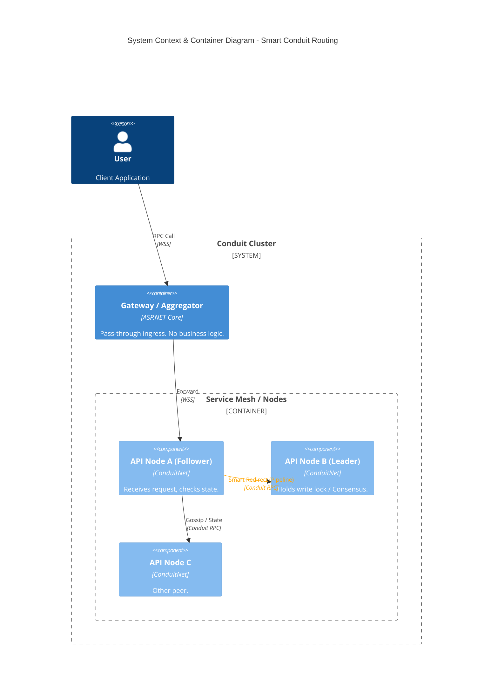
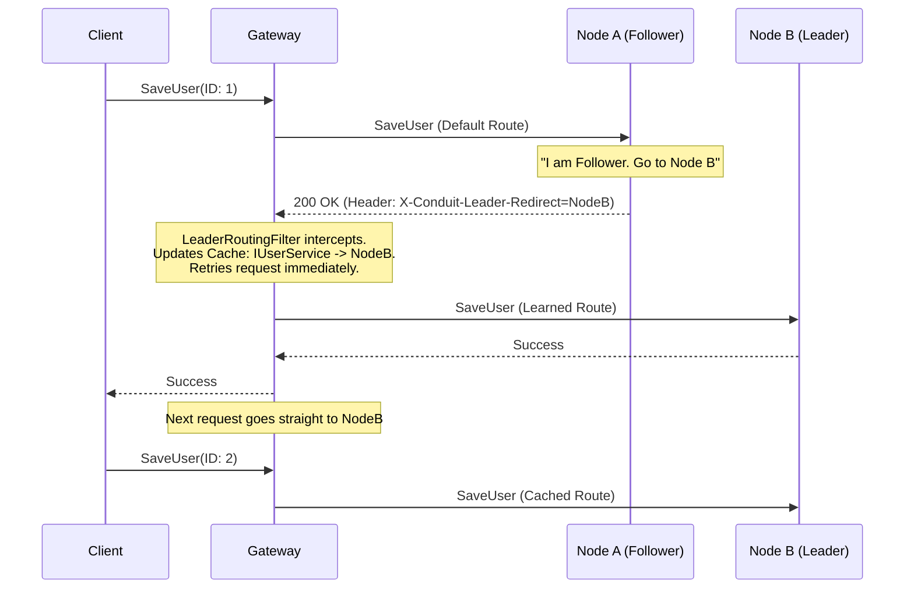

# Distributed Smart Routing Architecture

This architecture moves routing intelligence from a central gateway into the application's transport layer ("Conduit"). The Gateway acts solely as an aggregator/ingress, while individual services handle complex routing decisions (e.g., RAFT leader redirection, sharding, tenant locality) via the RPC Pipeline.

## Why this is better for Distributed Computing

1.  **Eliminates Gateway Bottlenecks**: The gateway doesn't need to know the complex state of the cluster (who is leader, which shard holds data). It just passes messages.
2.  **Smart Hops**: Services can redirect requests peer-to-peer based on internal state (e.g., "I am not the leader, Node C is") without the client needing to retry or the gateway needing to be state-aware.
3.  **Encapsulated Complexity**: Routing logic (sharding, consensus) lives with the data/domain logic, not leaked into infrastructure configuration.
4.  **Lower Latency**: Internal redirects happen over persistent WebSocket links between services, avoiding a full round-trip back to the client or gateway.

## C4 Container Diagram

## Request Flow (Sequence)

The `RpcRequestDelegate` chain inspects the message. If the local node cannot handle it (e.g., not leader), the **Routing Filter** transparently forwards it to the correct peer.

```mermaid
sequenceDiagram
    participant Client
    participant Gateway
    participant NodeA as Node A (Follower)
    participant NodeB as Node B (Leader)

    Client->>Gateway: SaveUser(ID: 1)
    Gateway->>NodeA: Forward(SaveUser)
    
    rect rgb(20, 20, 20)
        note right of NodeA: Conduit Pipeline
        NodeA->>NodeA: AuthFilter (Pass)
        NodeA->>NodeA: ConsensusFilter (Check Role)
        Note over NodeA: "I am Follower. Leader is Node B"
        NodeA->>NodeB: Forward Request (P2P)
    end
    
    NodeB->>NodeB: Execute Logic
    NodeB-->>NodeA: Result (Success)
    NodeA-->>Gateway: Result (Success)
    Gateway-->>Client: Result (Success)
```

## Just-In-Time Routing (Client-Side Learning)

In addition to server-side forwarding, the system supports a **Smart Client** model where the caller (Gateway) learns the topology dynamically. This avoids hardcoding routing rules in the Gateway.

### The "Ignorant Gateway" Pattern

1.  **Default State**: The Gateway has **no knowledge** of the cluster topology (who is leader, which shard is where). It uses a basic `ServiceDiscoveryFilter` to find *any* node.
2.  **Feedback Loop**: If the Gateway hits a Follower node for a write operation, the Follower responds with a `X-Conduit-Leader-Redirect` header pointing to the current Leader.
3.  **Live Injection**: The `LeaderRoutingFilter` in the Gateway intercepts this header and **injects** a new routing rule into its local cache for that specific interface.
4.  **Persistence**: Subsequent requests for that interface are routed directly to the Leader. If leadership changes, the new Leader (or old Leader) will send a new redirect, updating the Gateway's map.

This ensures the routing implementation is effectively "provided" by the underlying API at runtime, keeping the Gateway infrastructure dumb and the routing logic centralized in the domain services.

