# Finance & Supply Chain Management Architecture

## Executive Summary

This document outlines a Domain-Driven Design (DDD) architecture for a distributed Finance and Supply Chain Management system built on ConduitNet. The system comprises two financial bounded contexts (Finance1: Core Accounting, Finance2: Treasury & Risk) and a Supply Chain Management context, all communicating via WebSocket-based RPC through the Conduit mesh.

---

## 1. Strategic Domain Design

### 1.1 Domain Overview

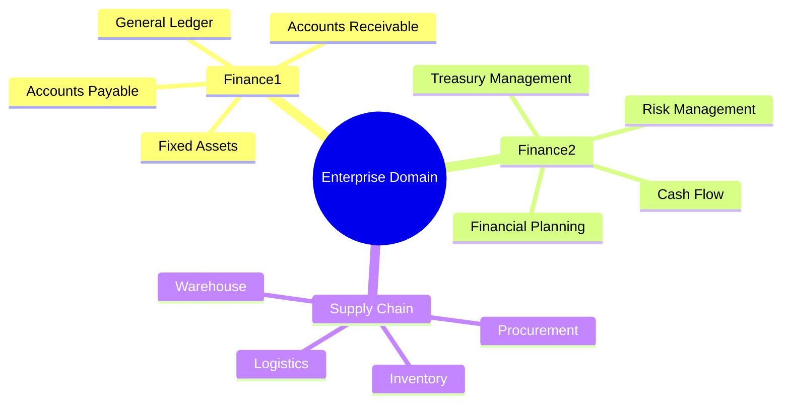

### 1.2 Bounded Contexts & Context Map

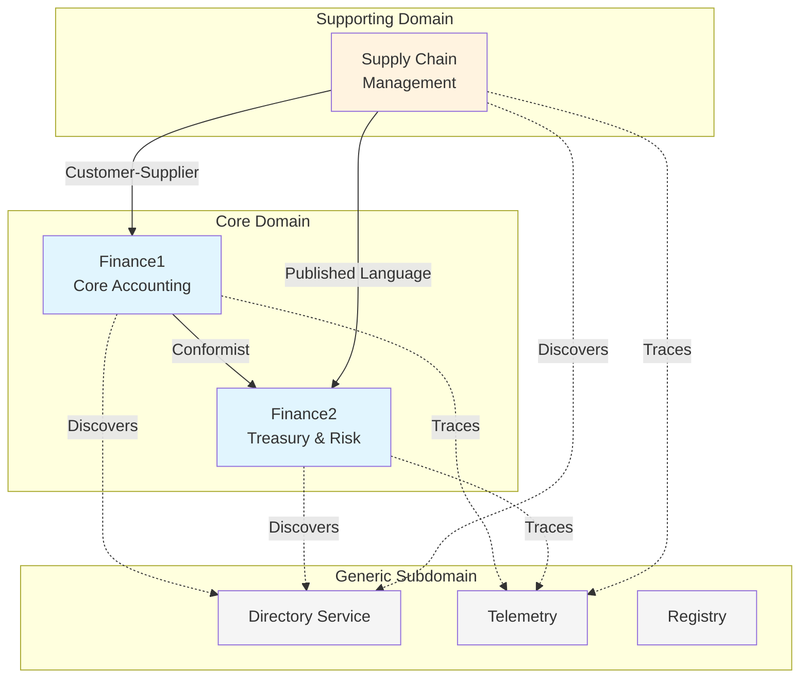

### 1.3 Context Relationships

| Upstream | Downstream | Relationship | Description |
|----------|------------|--------------|-------------|
| Finance1 | Finance2 | Conformist | Treasury conforms to GL account structures |
| Finance1 | Supply Chain | Customer-Supplier | SCM raises purchase orders, F1 processes invoices |
| Finance2 | Supply Chain | Published Language | SCM consumes cash flow forecasts via shared contracts |

---

## 2. C4 Model Architecture

### 2.1 Level 1: System Context Diagram

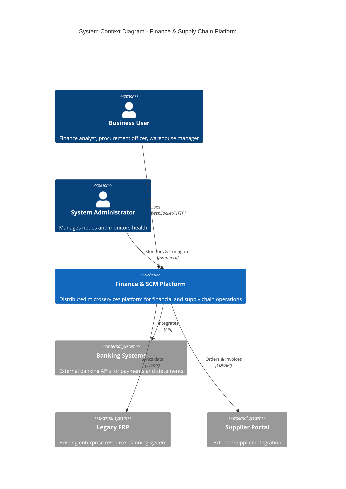

### 2.2 Level 2: Container Diagram

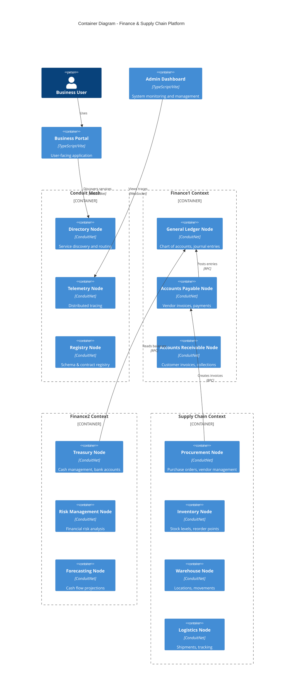

### 2.3 Level 3: Component Diagram (Finance1 - General Ledger Node)

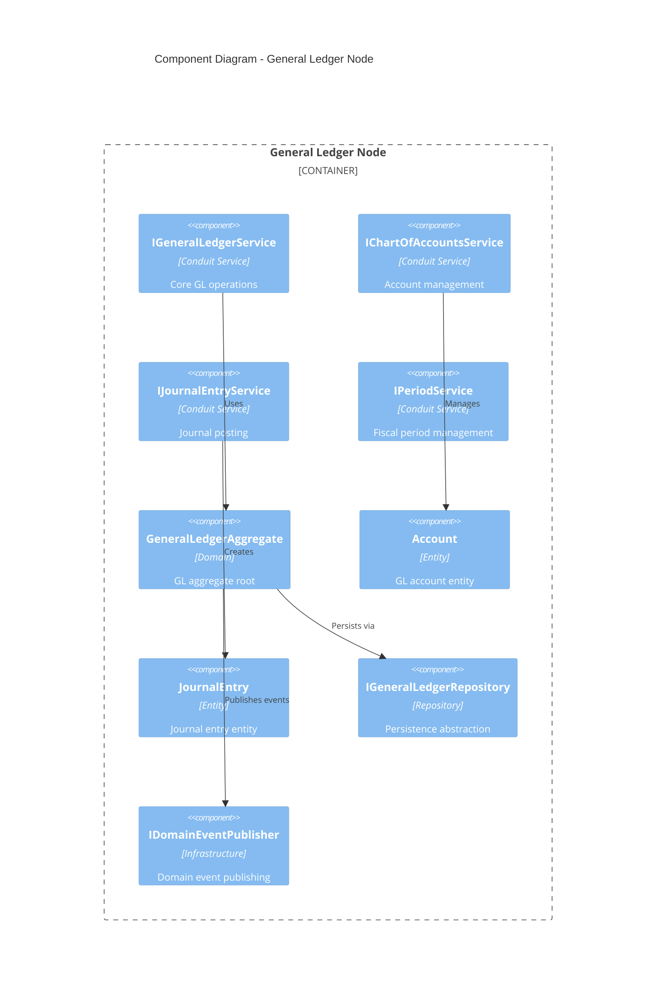

---

## 3. Domain Model

### 3.1 Finance1: Core Accounting Domain

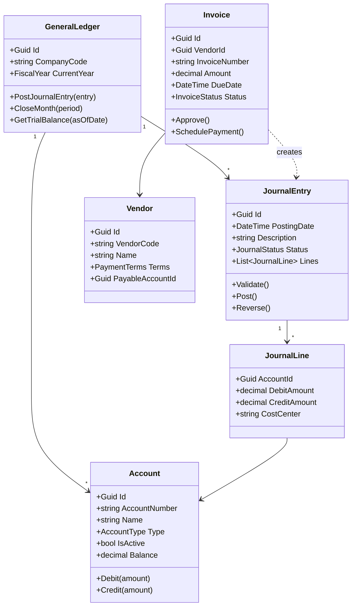

### 3.2 Finance2: Treasury & Risk Domain

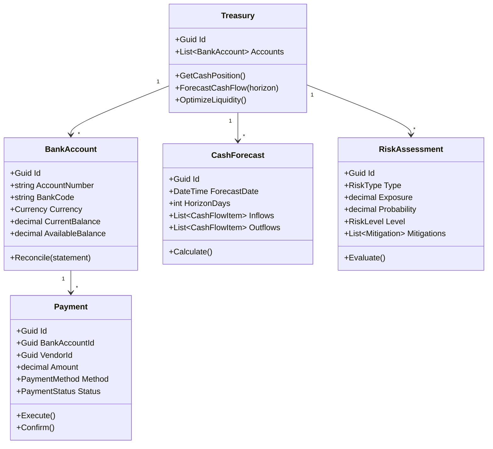

### 3.3 Supply Chain Management Domain

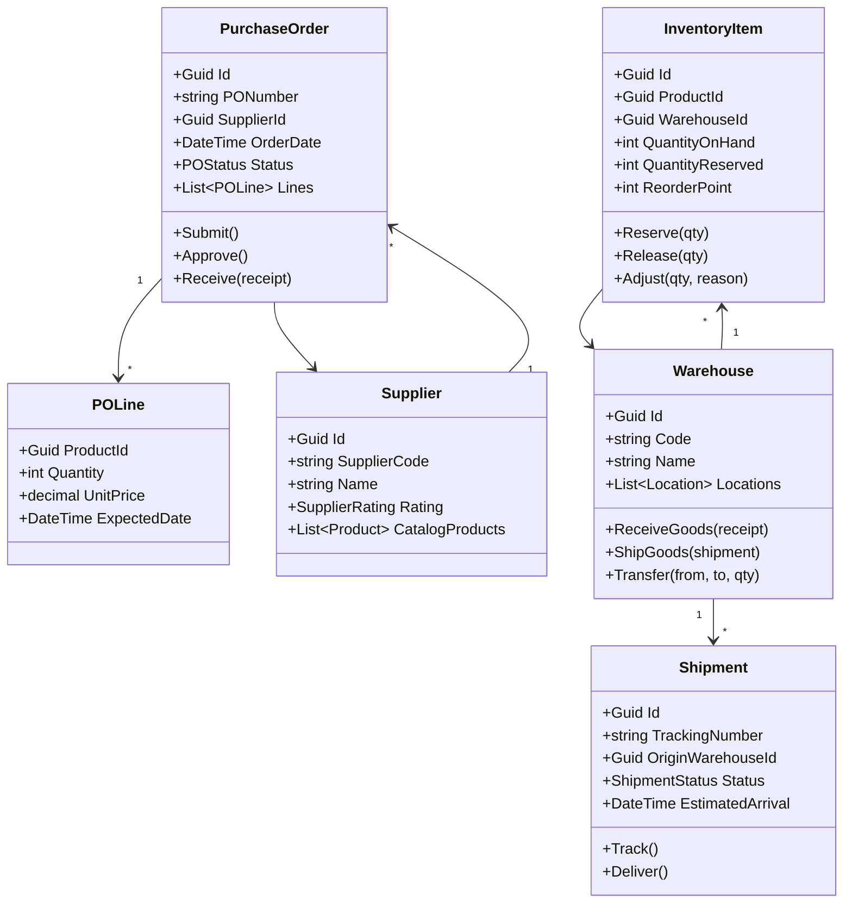

---

## 4. Conduit Node Architecture

### 4.1 Node Deployment Topology

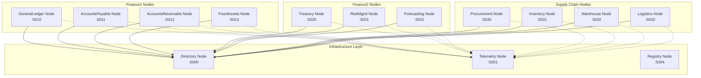

### 4.2 Service Interface Contracts

```
ConduitNet.Examples.FinanceSupplyChain/
├── Contracts/
│   ├── Finance1/
│   │   ├── IGeneralLedgerService.cs
│   │   ├── IAccountsPayableService.cs
│   │   ├── IAccountsReceivableService.cs
│   │   └── DTOs/
│   │       ├── AccountDto.cs
│   │       ├── JournalEntryDto.cs
│   │       └── InvoiceDto.cs
│   ├── Finance2/
│   │   ├── ITreasuryService.cs
│   │   ├── IRiskManagementService.cs
│   │   ├── IForecastingService.cs
│   │   └── DTOs/
│   │       ├── CashPositionDto.cs
│   │       ├── RiskAssessmentDto.cs
│   │       └── ForecastDto.cs
│   └── SupplyChain/
│       ├── IProcurementService.cs
│       ├── IInventoryService.cs
│       ├── IWarehouseService.cs
│       ├── ILogisticsService.cs
│       └── DTOs/
│           ├── PurchaseOrderDto.cs
│           ├── InventoryItemDto.cs
│           └── ShipmentDto.cs
```

---

## 5. Integration Patterns

### 5.1 Purchase-to-Pay Flow

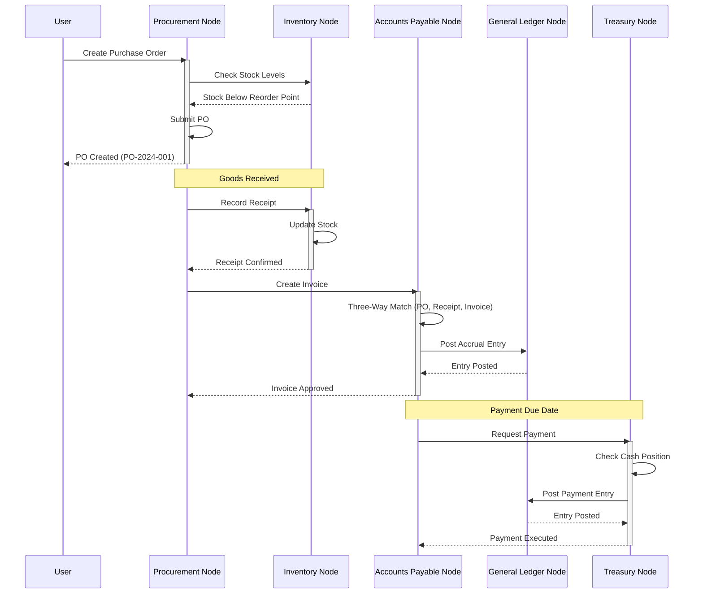

### 5.2 Month-End Close Flow

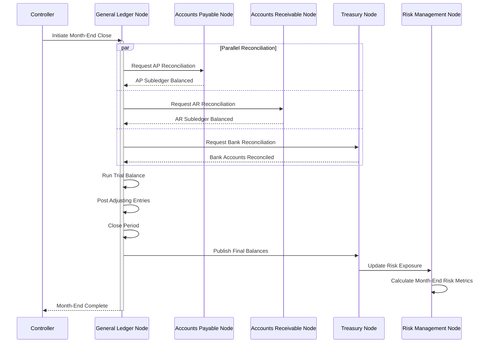

### 5.3 Cash Flow Forecasting

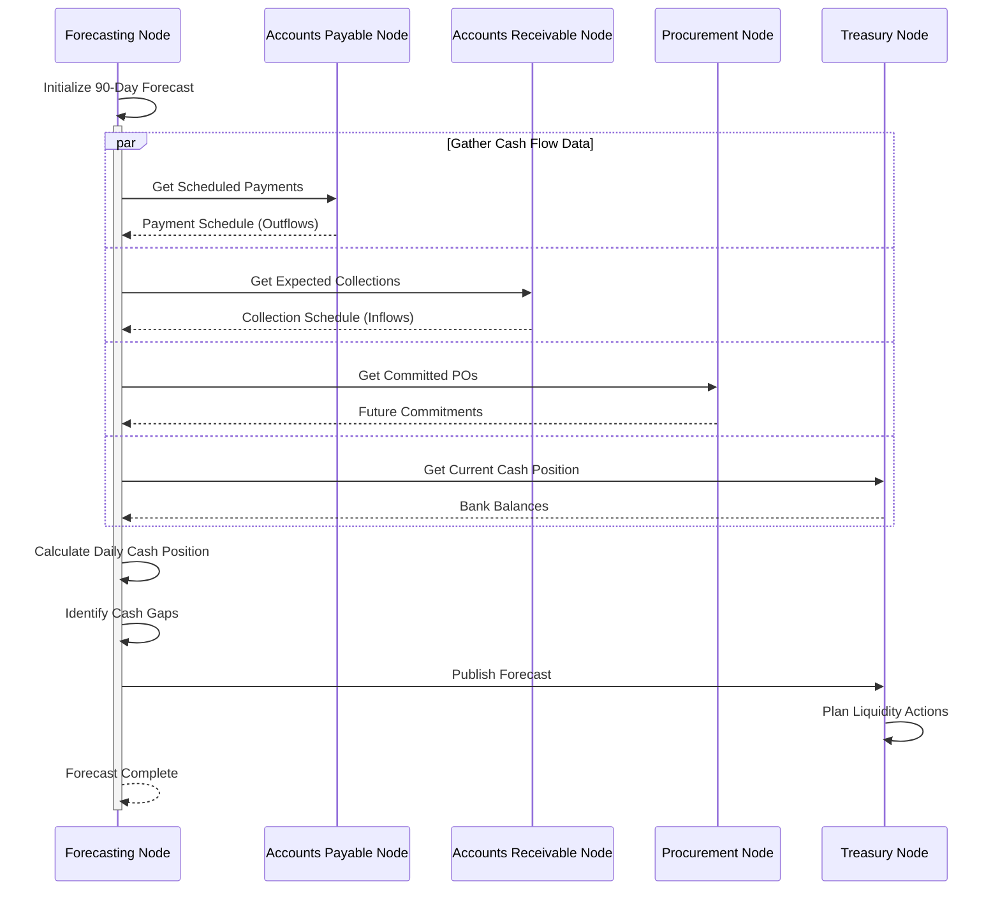

---

## 6. Application Architecture

### 6.1 Node Internal Architecture (Hexagonal/Clean Architecture)

```
┌─────────────────────────────────────────────────────────────────┐
│                        Conduit Node                              │
├─────────────────────────────────────────────────────────────────┤
│  ┌─────────────────────────────────────────────────────────┐   │
│  │                 Application Layer                         │   │
│  │  ┌─────────────┐  ┌─────────────┐  ┌─────────────┐      │   │
│  │  │  Commands   │  │   Queries   │  │   Events    │      │   │
│  │  │  Handlers   │  │  Handlers   │  │  Handlers   │      │   │
│  │  └─────────────┘  └─────────────┘  └─────────────┘      │   │
│  └─────────────────────────────────────────────────────────┘   │
│                              │                                   │
│  ┌─────────────────────────────────────────────────────────┐   │
│  │                   Domain Layer                            │   │
│  │  ┌─────────────┐  ┌─────────────┐  ┌─────────────┐      │   │
│  │  │ Aggregates  │  │  Entities   │  │Value Objects│      │   │
│  │  └─────────────┘  └─────────────┘  └─────────────┘      │   │
│  │  ┌─────────────┐  ┌─────────────┐                        │   │
│  │  │Domain Events│  │Domain Svc   │                        │   │
│  │  └─────────────┘  └─────────────┘                        │   │
│  └─────────────────────────────────────────────────────────┘   │
│                              │                                   │
│  ┌─────────────────────────────────────────────────────────┐   │
│  │               Infrastructure Layer                        │   │
│  │  ┌───────────┐ ┌───────────┐ ┌───────────┐ ┌──────────┐ │   │
│  │  │Conduit Svc│ │Repository │ │ Event Bus │ │ External │ │   │
│  │  │ Adapters  │ │   Impl    │ │   Impl    │ │ Adapters │ │   │
│  │  └───────────┘ └───────────┘ └───────────┘ └──────────┘ │   │
│  └─────────────────────────────────────────────────────────┘   │
├─────────────────────────────────────────────────────────────────┤
│                    ConduitNet Framework                          │
│  ┌───────────┐ ┌───────────┐ ┌───────────┐ ┌───────────┐       │
│  │ WebSocket │ │ Discovery │ │ Telemetry │ │Serializer │       │
│  │   RPC     │ │  Client   │ │  Export   │ │ MessagePk │       │
│  └───────────┘ └───────────┘ └───────────┘ └───────────┘       │
└─────────────────────────────────────────────────────────────────┘
```

### 6.2 Project Structure

```
Examples/
└── FinanceSupplyChain/
    ├── ARCHITECTURE.md                    # This document
    │
    ├── src/
    │   ├── Contracts/                     # Shared contracts (Published Language)
    │   │   ├── FinanceSupplyChain.Contracts.csproj
    │   │   ├── Finance1/
    │   │   │   ├── IGeneralLedgerService.cs
    │   │   │   ├── IAccountsPayableService.cs
    │   │   │   ├── IAccountsReceivableService.cs
    │   │   │   └── DTOs/
    │   │   ├── Finance2/
    │   │   │   ├── ITreasuryService.cs
    │   │   │   ├── IRiskManagementService.cs
    │   │   │   └── DTOs/
    │   │   └── SupplyChain/
    │   │       ├── IProcurementService.cs
    │   │       ├── IInventoryService.cs
    │   │       └── DTOs/
    │   │
    │   ├── Finance1/                      # Finance1 Bounded Context
    │   │   ├── GeneralLedger/
    │   │   │   ├── GeneralLedger.Node.csproj
    │   │   │   ├── Program.cs
    │   │   │   ├── Domain/
    │   │   │   │   ├── Aggregates/
    │   │   │   │   ├── Entities/
    │   │   │   │   ├── ValueObjects/
    │   │   │   │   └── Events/
    │   │   │   ├── Application/
    │   │   │   │   ├── Commands/
    │   │   │   │   ├── Queries/
    │   │   │   │   └── Services/
    │   │   │   └── Infrastructure/
    │   │   │       ├── Repositories/
    │   │   │       └── ConduitServices/
    │   │   │           └── GeneralLedgerService.cs
    │   │   │
    │   │   ├── AccountsPayable/
    │   │   │   └── ... (same structure)
    │   │   │
    │   │   └── AccountsReceivable/
    │   │       └── ... (same structure)
    │   │
    │   ├── Finance2/                      # Finance2 Bounded Context
    │   │   ├── Treasury/
    │   │   ├── RiskManagement/
    │   │   └── Forecasting/
    │   │
    │   └── SupplyChain/                   # Supply Chain Bounded Context
    │       ├── Procurement/
    │       ├── Inventory/
    │       ├── Warehouse/
    │       └── Logistics/
    │
    ├── tests/
    │   ├── Finance1.Tests/
    │   ├── Finance2.Tests/
    │   ├── SupplyChain.Tests/
    │   └── Integration.Tests/
    │
    └── scripts/
        ├── run-finance1.ps1
        ├── run-finance2.ps1
        ├── run-supplychain.ps1
        └── run-all.ps1
```

---

## 7. Data Consistency Patterns

### 7.1 Saga Pattern for Cross-Context Transactions

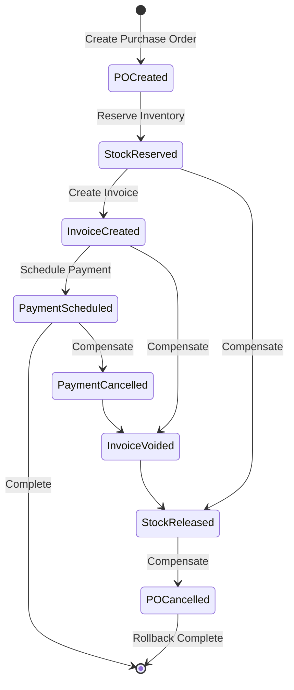

### 7.2 Event-Driven Integration

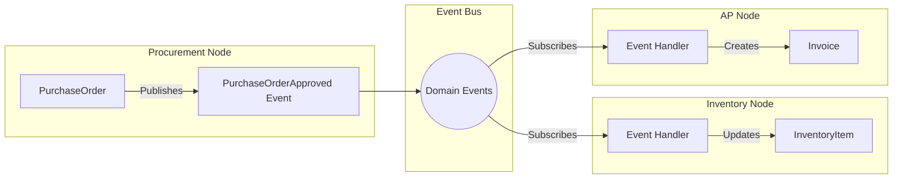

---

## 8. Security & Access Control

### 8.1 Service-Level Authorization

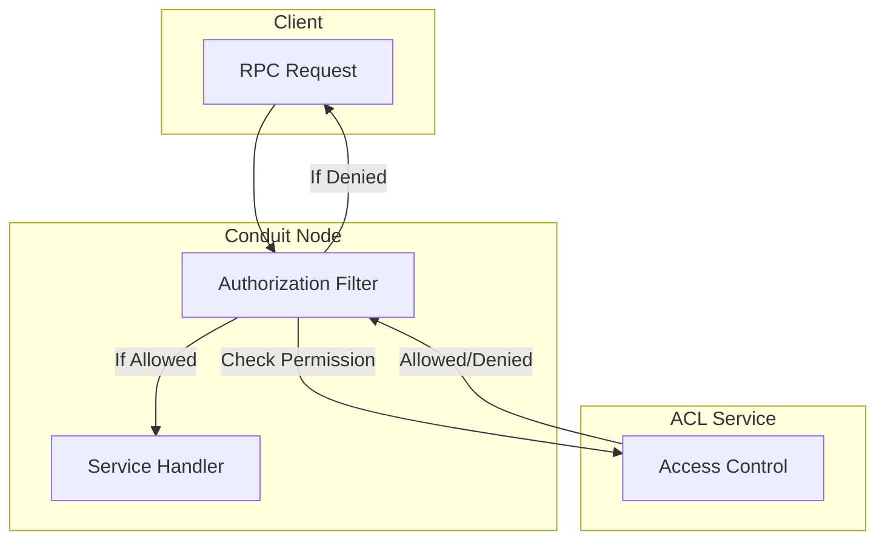

### 8.2 Role-Based Access Matrix

| Role | Finance1 | Finance2 | Supply Chain |
|------|----------|----------|--------------|
| Finance Manager | Full | Read | Read |
| Treasury Analyst | Read | Full | None |
| Procurement Officer | Invoice View | Forecast View | Full |
| Warehouse Staff | None | None | Inventory/Warehouse |
| Auditor | Read | Read | Read |

---

## 9. Deployment Configuration

### 9.1 Development Environment

```powershell
# run-all.ps1
# Start all Finance & Supply Chain nodes for development

# Infrastructure
Start-ConduitService -Project "ConduitNet.Directory" -Port 5000 -Title "Directory"
Start-Sleep -Seconds 2
Start-ConduitService -Project "ConduitNet.Telemetry" -Port 5001 -Title "Telemetry"

# Finance1 Context
Start-ConduitService -Project "GeneralLedger.Node" -Port 5010 -Title "General Ledger"
Start-ConduitService -Project "AccountsPayable.Node" -Port 5011 -Title "Accounts Payable"
Start-ConduitService -Project "AccountsReceivable.Node" -Port 5012 -Title "Accounts Receivable"

# Finance2 Context
Start-ConduitService -Project "Treasury.Node" -Port 5020 -Title "Treasury"
Start-ConduitService -Project "RiskManagement.Node" -Port 5021 -Title "Risk Management"
Start-ConduitService -Project "Forecasting.Node" -Port 5022 -Title "Forecasting"

# Supply Chain Context
Start-ConduitService -Project "Procurement.Node" -Port 5030 -Title "Procurement"
Start-ConduitService -Project "Inventory.Node" -Port 5031 -Title "Inventory"
Start-ConduitService -Project "Warehouse.Node" -Port 5032 -Title "Warehouse"
Start-ConduitService -Project "Logistics.Node" -Port 5033 -Title "Logistics"
```

### 9.2 Port Allocation

| Context | Node | Port |
|---------|------|------|
| Infrastructure | Directory | 5000 |
| Infrastructure | Telemetry | 5001 |
| Infrastructure | Registry | 5004 |
| Finance1 | General Ledger | 5010 |
| Finance1 | Accounts Payable | 5011 |
| Finance1 | Accounts Receivable | 5012 |
| Finance1 | Fixed Assets | 5013 |
| Finance2 | Treasury | 5020 |
| Finance2 | Risk Management | 5021 |
| Finance2 | Forecasting | 5022 |
| Supply Chain | Procurement | 5030 |
| Supply Chain | Inventory | 5031 |
| Supply Chain | Warehouse | 5032 |
| Supply Chain | Logistics | 5033 |

---

## 10. Next Steps

1. **Phase 1: Core Infrastructure**
   - [ ] Create shared Contracts project
   - [ ] Define service interfaces for each bounded context
   - [ ] Create DTOs with MessagePack serialization

2. **Phase 2: Finance1 Implementation**
   - [ ] Implement General Ledger Node
   - [ ] Implement Accounts Payable Node
   - [ ] Implement Accounts Receivable Node
   - [ ] Integration tests

3. **Phase 3: Finance2 Implementation**
   - [ ] Implement Treasury Node
   - [ ] Implement Risk Management Node
   - [ ] Implement Forecasting Node
   - [ ] Cross-context integration

4. **Phase 4: Supply Chain Implementation**
   - [ ] Implement Procurement Node
   - [ ] Implement Inventory Node
   - [ ] Implement Warehouse Node
   - [ ] Implement Logistics Node

5. **Phase 5: Integration & Testing**
   - [ ] End-to-end Purchase-to-Pay flow
   - [ ] Month-end close process
   - [ ] Performance testing
   - [ ] Security audit

---

## Appendix A: Technology Stack

| Layer | Technology |
|-------|------------|
| Runtime | .NET 9.0 |
| RPC Framework | ConduitNet (WebSocket + MessagePack) |
| Service Discovery | ConduitNet Directory |
| Observability | OpenTelemetry + ConduitNet Telemetry |
| Serialization | MessagePack |
| Frontend | TypeScript + Vite |
| Database | TBD (PostgreSQL recommended) |
| Event Store | TBD (EventStoreDB recommended) |

## Appendix B: References

- [Domain-Driven Design by Eric Evans](https://www.domainlanguage.com/ddd/)
- [C4 Model by Simon Brown](https://c4model.com/)
- [ConduitNet Documentation](../README.md)
- [Implementing Domain-Driven Design by Vaughn Vernon](https://www.informit.com/store/implementing-domain-driven-design-9780321834577)
