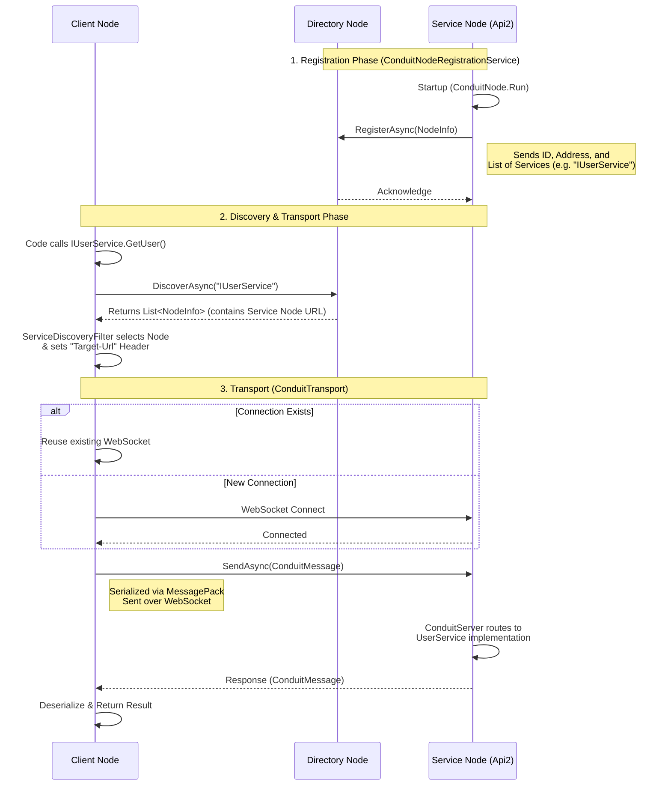
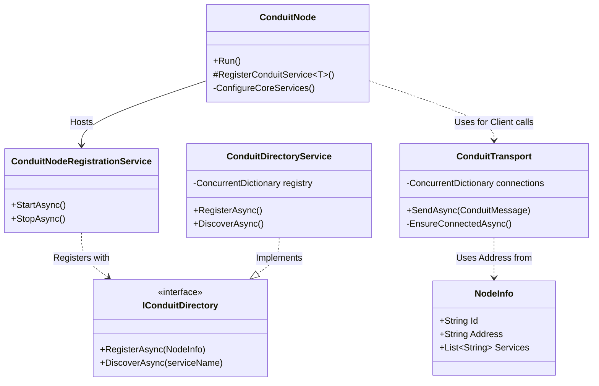

# Conduit Transport & Discovery Architecture

This document details the internal mechanics of the Conduit transport layer, service discovery, and node registration process.

## Interaction Flow (Sequence Diagram)

This diagram illustrates the lifecycle: from a Service Node registering itself, to a Client Node discovering it and establishing a persistent WebSocket transport connection.

## Component Architecture (Class Diagram)

This diagram shows the relationships between the core classes involved in the transport and discovery mechanisms.

## Key Concepts

1.  **Registration**: Every `ConduitNode` automatically registers its services with the Directory upon startup via the `ConduitNodeRegistrationService`.
2.  **Discovery**: Clients don't know where services live. They ask the `IConduitDirectory` (which is just another RPC service) to find providers.
3.  **Transport**: `ConduitTransport` manages persistent WebSocket connections. It multiplexes multiple RPC calls over a single WebSocket connection using `MessagePack` serialization and a custom framing protocol (Length Prefix + Payload).
